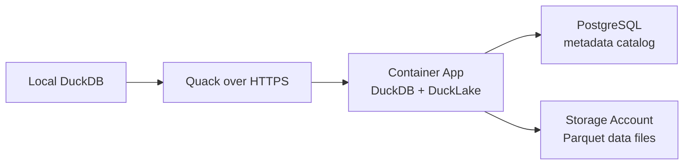

# AzQuack

Deploy a small Azure lakehouse playground for trying DuckDB Quack with DuckLake.

You get:

- a Storage Account for DuckLake data files,
- a cheap PostgreSQL Flexible Server for DuckLake metadata,
- a Container App running DuckDB in DuckLake mode,
- Quack exposed over HTTPS,
- local DuckDB scripts that attach to the Azure-hosted DuckDB and write data into DuckLake.

> [!WARNING]
> Quack is beta in DuckDB 1.5.2 and is installed from `core_nightly`.
> The protocol, extension functions, and defaults can still change before DuckDB 2.0.

## Prerequisites

Install:

- Azure Developer CLI (`azd`)
- Azure CLI (`az`)
- DuckDB CLI `v1.5.2`
- Docker
- `curl`
- Python 3

Your Azure principal must be able to create the resource group resources and role assignments.
In practice, use `Owner` at the subscription/resource-group scope, or `Contributor` plus `User Access Administrator`, because the deployment grants managed identity access to Storage, ACR, and Key Vault.

Log in with both Azure tools before the first deployment:

```sh
az login
az account set --subscription <subscription-id>
azd auth login
```

If the preprovision hook cannot identify the signed-in Azure CLI user, set the local operator principal before `azd up`:

```sh
azd env set OPERATOR_PRINCIPAL_ID "$(az ad signed-in-user show --query id -o tsv)"
azd env set OPERATOR_PRINCIPAL_TYPE User
```

Check the local DuckDB CLI:

```sh
duckdb -csv -c 'SELECT version();'
```

## The One Command

After Azure login and environment selection, deploy everything with:

```sh
azd up
```

That command provisions the Azure infrastructure, builds the container image, deploys the Container App, and prints the Quack endpoint values.

For a completely fresh environment:

```sh
az login
az account set --subscription <subscription-id>
azd auth login
azd env new azquack-dev --location westus --subscription <subscription-id>
azd up
```

The environment name becomes the resource group name:

```text
azquack-dev -> rg-azquack-dev
```

Use a new environment name when you want a new resource group.

## Motivation

DuckDB can run locally, but Quack lets a local DuckDB client talk to a remote DuckDB server.

DuckLake separates:

- metadata in a SQL catalog,
- data files in object storage.

AzQuack combines those pieces on Azure:



The local machine does not connect directly to PostgreSQL or Storage.
It authenticates to Quack, sends SQL to the Azure-hosted DuckDB process, and that process writes to DuckLake.

## First Steps

Create a new environment and deploy:

```sh
az login
az account set --subscription <subscription-id>
azd auth login
azd env new azquack-dev --location westus --subscription <subscription-id>
azd up
```

Then write test data from local DuckDB through Quack:

```sh
./scripts/connect-local.sh
```

The script installs the local Quack extension, reads the token from Key Vault, attaches the remote endpoint, and inserts a smoke-test row:

```sql
FORCE INSTALL quack FROM core_nightly;
LOAD quack;

CREATE OR REPLACE SECRET azquack_remote (
    TYPE quack,
    SCOPE 'quack:<container-app-fqdn>:443',
    TOKEN '<token-from-key-vault>'
);

ATTACH 'quack:<container-app-fqdn>:443' AS remote (TYPE quack);

FROM remote.query(
    'INSERT INTO azquack.demo.events
     SELECT 2, ''local-client-smoke'', now()
     WHERE NOT EXISTS (SELECT 1 FROM azquack.demo.events WHERE event_id = 2)'
);
```

> [!NOTE]
> `remote` is not a PostgreSQL connection.
> It is a local DuckDB attachment to the Azure-hosted DuckDB server through Quack.

## What Gets Deployed

`azd up` creates a new resource group and these resources:

| Resource | Purpose |
| --- | --- |
| Storage Account | DuckLake Parquet/data files under `az://lakehouse/data/` |
| PostgreSQL Flexible Server | DuckLake metadata catalog only |
| Azure Container Registry | Stores the AzQuack image |
| Container Apps Environment | Hosts the Container App |
| Container App | Runs DuckDB, DuckLake, Quack, and Caddy |
| Key Vault | Stores the Quack token and database passwords |
| Log Analytics workspace | Container App logs |

The PostgreSQL SKU defaults to `Standard_B1ms` in the Burstable tier with 32 GiB storage.
That is intentionally small for experimentation.

## How Authentication Works

The local client authenticates to Quack with a shared token stored in Key Vault.

`scripts/connect-local.sh` does this:

```sh
KEY_VAULT_NAME="$(azd env get-value KEY_VAULT_NAME)"
QUACK_TOKEN="$(az keyvault secret show --vault-name "$KEY_VAULT_NAME" --name quack-token --query value -o tsv)"
```

Then it creates a scoped DuckDB secret:

```sql
CREATE OR REPLACE SECRET azquack_remote (
    TYPE quack,
    SCOPE 'quack:<container-app-fqdn>:443',
    TOKEN '<token-from-key-vault>'
);
```

> [!WARNING]
> The Quack token is a write credential for the remote DuckDB server.
> A token holder can run SQL against objects visible to that server session.
> Treat this repo as a single-admin experiment until Quack authorization callbacks are added.

The Quack endpoint is internet-reachable in this prototype.
It is protected by the shared Quack token, not by Microsoft Entra ID, IP allowlists, WAF, or rate limiting.

## Prototype Security Boundaries

This repo is intentionally scoped as a beta experiment, not a hardened production deployment.

- The PostgreSQL server currently uses the Azure-services firewall exception so the Container App can reach the DuckLake metadata catalog without private networking.
- Key Vault uses Azure RBAC and secret-scope assignments, but public network access remains enabled.
- Storage disables public blob access and shared-key auth, but the storage account endpoint remains public and protected by Entra/RBAC rather than private networking.
- ACR admin credentials are disabled and image pulls use managed identity, but the registry endpoint remains public in this prototype.
- The Container App receives the PostgreSQL administrator secret only for startup role bootstrap. The app removes `AZQUACK_PG_ADMIN_USER` and `AZQUACK_PG_ADMIN_PASSWORD` from the process environment before Quack starts serving remote SQL, but the Container App identity still has Key Vault access to that secret until a one-shot bootstrap job is added.
- A hardened variant should use Container Apps VNet integration, private PostgreSQL access, private Key Vault and Storage access, private ACR access, and a one-shot bootstrap job so the serving app never receives the PostgreSQL administrator secret.

## Cost Boundaries

`azd up` creates billable Azure resources that keep accruing cost until teardown.
The defaults are intentionally small for experimentation, but they still include an always-on PostgreSQL Flexible Server (`Standard_B1ms`, 32 GiB storage), one warm Container App replica, ACR Basic, Hot Blob Storage, Key Vault, and a Log Analytics workspace with 30-day retention.

Run `azd down --purge` when you are done.

## DuckLake Mode

The Container App starts DuckDB and attaches DuckLake:

```sql
ATTACH 'ducklake:postgres:dbname=<catalog_db> host=<postgres_fqdn> port=5432 user=ducklake_app sslmode=require'
AS azquack (
    DATA_PATH 'az://lakehouse/data/',
    META_SECRET 'azquack_pg_catalog',
    AUTOMATIC_MIGRATION true
);

USE azquack;
```

PostgreSQL stores DuckLake metadata.
Azure Blob Storage stores the actual DuckLake data files.

The Container App uses a managed identity for Blob access.
The runtime PostgreSQL user is `ducklake_app`, not the PostgreSQL administrator.

## Validate the Deployment

After `azd up`, run:

```sh
./scripts/validate-deployment.sh
```

It checks:

- the HTTPS health endpoint,
- authenticated Quack attach,
- `whoami()` through the remote server,
- direct remote-catalog writes through Quack,
- DuckLake file metadata for a fresh validation table,
- wrong-token rejection,
- DuckLake data files in Blob Storage,
- row persistence after a Container App revision restart,
- recent Container App logs for literal secret values that the operator can read.

The validation machine needs `az`, `azd`, `duckdb`, `curl`, and Azure RBAC that can read the Quack token, read recent Container App logs, list blobs in the deployed Storage Account, and restart the active Container App revision.

> [!WARNING]
> `scripts/validate-deployment.sh` inserts rows into `demo.events` and restarts the active Container App revision to prove DuckLake persistence.

## Live Proof

This repo was validated on 2026-05-13 in a fresh Azure resource group.
Keep exact environment names and endpoints in local run logs, not in committed docs.

```text
Environment: <unique azd environment>
Resource group: rg-<unique azd environment>
Region: westus
Endpoint: https://<container-app-fqdn>/
```

Evidence from `./scripts/validate-deployment.sh`:

```text
local_duckdb_version: v1.5.2
remote_duckdb_version: v1.5.2
validation_row_count: 1000
validation_file_count: 1
DuckLake blob count before write: 3, after write: 5
Deployment validation passed.
```

Observed result from `./scripts/connect-local.sh`:

```text
local-client-smoke row inserted through Quack and read back from azquack.demo.events.
```

## Local Checks

Before deployment:

```sh
./scripts/check.sh
```

That runs Python compile checks, Bicep build, and Docker build.

## Generated Environment Values

The AZD `preprovision` hook creates these values when missing:

> [!WARNING]
> AZD environment files are secret-bearing because the hook stores generated passwords and the Quack token as environment values for Bicep parameters.
> The repo ignores `.azure/*/.env`, but treat the active AZD environment as sensitive local state.

| Value | Meaning |
| --- | --- |
| `POSTGRES_ADMIN_PASSWORD` | Bootstrap PostgreSQL admin password |
| `DUCKLAKE_CATALOG_PASSWORD` | Password for `ducklake_app` |
| `QUACK_TOKEN` | Token required by local DuckDB clients |
| `DUCKLAKE_DATA_PATH` | Default `az://lakehouse/data/` path |
| `OPERATOR_PRINCIPAL_ID` | Principal allowed to read the Quack token for local tests |
| `OPERATOR_PRINCIPAL_TYPE` | Defaults to `User` |

## Cleanup

Remove the whole experiment:

```sh
azd down --purge
```

Key Vault soft delete is enabled.
Purge protection is disabled for this prototype so cleanup can fully remove resources when your account has purge permission.

## Learn More

- [DuckDB Quack overview](https://duckdb.org/docs/current/quack/overview)
- [DuckDB Quack security](https://duckdb.org/docs/current/quack/security)
- [DuckDB Quack reverse proxy setup](https://duckdb.org/docs/current/quack/setup/reverse_proxy)
- [DuckLake DuckDB introduction](https://ducklake.select/docs/stable/duckdb/introduction)
- [DuckDB Azure extension](https://duckdb.org/docs/current/core_extensions/azure)
