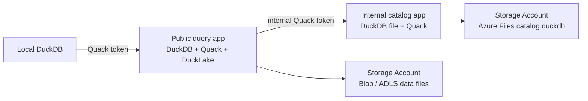

# AzQuack

Deploy a small Azure playground for **DuckDB**, **Quack**, and **DuckLake**.

This version is PostgreSQL-free.

It uses:

- Azure Blob / ADLS-style storage for DuckLake data files
- Azure Files for the DuckDB file that stores DuckLake metadata
- one internal Container App for the DuckLake catalog
- one public Container App for local DuckDB clients
- Quack between local DuckDB and Azure
- Quack again between the query app and the internal catalog app

> [!WARNING]
> This is a beta experiment.
> Quack is under active development, and DuckLake-with-Quack catalog support is new in DuckDB `v1.5.3`.
> Use this repo to experiment, not as a production lakehouse architecture.

## What You Get

Run one deployment and you get the full test stack:



There is **no Azure PostgreSQL Flexible Server** in this profile.

DuckLake data files go to:

```text
az://lakehouse/data/
```

DuckLake metadata goes to a DuckDB file mounted into the internal catalog app:

```text
/catalog/catalog.duckdb
```

## Requirements

Install:

- Azure Developer CLI: `azd`
- Azure CLI: `az`
- DuckDB CLI `v1.5.3`
- Docker
- `curl`
- Python 3

Your Azure principal must be able to create resources and role assignments.
In practice, use `Owner`, or `Contributor` plus `User Access Administrator`, at the target subscription or resource-group scope.

Log in:

```sh
az login
az account set --subscription <subscription-id>
azd auth login
```

Check DuckDB:

```sh
duckdb -csv -c 'SELECT version();'
```

It must print:

```text
v1.5.3
```

## Deploy

Create a new environment so Azure creates a new resource group:

```sh
azd env new azquack-quackcat --location westus --subscription <subscription-id>
```

Then deploy everything:

```sh
azd up
```

The environment name becomes the resource group name:

```text
azquack-quackcat -> rg-azquack-quackcat
```

Use a fresh environment name for each experiment.

## Validate

Run the live validation:

```sh
./scripts/validate-deployment.sh
```

The validator checks:

- no PostgreSQL Flexible Server exists in the resource group
- the catalog Container App is internal-only
- the public query Container App is healthy
- local DuckDB can attach to the query app over Quack
- a wrong Quack token is rejected
- DuckLake writes data through the query app
- a basic transaction rollback/commit sequence behaves as expected
- two local writers can create separate DuckLake tables at the same time
- DuckLake metadata is stored through the internal catalog app
- DuckLake data files exist in Blob Storage
- `catalog.duckdb` exists in Azure Files
- query app restart preserves rows
- catalog app restart plus query reconnect preserves rows
- recent app logs do not contain the public Quack token
- recent app logs do not contain the internal catalog token when the validator principal can read it

Expected ending:

```text
Deployment validation passed.
```

## Query From Local DuckDB

After validation:

```sh
./scripts/connect-local.sh
```

That script:

1. reads `QUACK_URI` from the active AZD environment,
2. reads the public Quack token from Key Vault,
3. creates a local scoped Quack secret,
4. attaches the public query app,
5. inserts one smoke-test row into DuckLake,
6. reads the result back through Quack.

Equivalent SQL:

```sql
INSTALL quack;
LOAD quack;

CREATE OR REPLACE SECRET azquack_remote (
    TYPE quack,
    SCOPE 'quack:<query-app-fqdn>:443',
    TOKEN '<token-from-key-vault>'
);

ATTACH 'quack:<query-app-fqdn>:443' AS remote (TYPE quack);

FROM remote.query('FROM whoami()');
FROM remote.query(
    'INSERT INTO azquack.demo.events
     SELECT 2, ''local-client-smoke'', now()
     WHERE NOT EXISTS (
       SELECT 1 FROM azquack.demo.events WHERE event_id = 2
     )'
);
FROM remote.query('SELECT * FROM azquack.demo.events ORDER BY event_id');
```

## How DuckLake Uses Quack

The public query app starts DuckDB, creates an Azure managed-identity secret, and attaches DuckLake like this:

```sql
CREATE OR REPLACE SECRET azquack_catalog_quack (
    TYPE quack,
    SCOPE 'quack:<internal-catalog-app-fqdn>:443',
    TOKEN '<internal-token-from-key-vault>'
);

ATTACH 'ducklake:quack:<internal-catalog-app-fqdn>:443' AS azquack (
    DATA_PATH 'az://lakehouse/data/',
    AUTOMATIC_MIGRATION true
);

USE azquack;
```

The catalog app owns the DuckDB metadata file.
The query app owns Blob writes for DuckLake data files.
The local machine only talks to the public query app.

## What Gets Deployed

| Resource | Purpose |
| --- | --- |
| Storage Account | DuckLake Parquet/data files under `az://lakehouse/data/` |
| Catalog Storage Account | Azure Files share for `/catalog/catalog.duckdb` |
| Internal Container App | DuckDB catalog file exposed only inside ACA through Quack |
| Public Container App | DuckDB query endpoint exposed to local clients through Quack |
| Azure Container Registry | Stores the container image |
| Container Apps Environment | Hosts both Container Apps |
| Key Vault | Stores public and internal Quack tokens |
| Log Analytics workspace | Container App logs |
| Managed identities | Separate identities for query and catalog apps |

## Authentication

There are two token planes:

| Token | Used by | Purpose |
| --- | --- | --- |
| `quack-token` | local DuckDB -> public query app | public experiment access |
| `catalog-quack-token` | query app -> internal catalog app | private metadata catalog access |

The local scripts read only `quack-token`.
They do not need the internal catalog token.

> [!WARNING]
> The public Quack token is a write credential.
> A holder can run SQL against objects visible to the query app.
> That includes transitive write access to DuckLake through the internal catalog app.
> Quack authorization callbacks are not implemented in this prototype.

## Security Boundaries

This deployment is intentionally small and easy to inspect.
It is not hardened.

- The catalog app uses internal Container Apps ingress only.
- The query app is internet-reachable and protected by the public Quack token.
- Blob public access is disabled.
- The DuckLake data Storage Account disables shared-key access.
- ACR admin credentials are disabled.
- Image pulls use managed identity.
- Key Vault uses Azure RBAC, but public network access is still enabled.
- The catalog Azure Files account uses shared-key access because Container Apps Azure Files mounts require a storage key.

A hardened version should add private networking, stricter Quack authorization, network restrictions in front of the query app, and backup/restore automation for the catalog DuckDB file.

## Cost

This deployment removes the PostgreSQL Flexible Server cost.

It still creates billable resources:

- two always-on Container App replicas
- two Storage Accounts
- Azure Files
- Azure Container Registry Basic
- Key Vault
- Log Analytics

Clean up when done:

```sh
azd down --purge --force --no-prompt
```

## Local Checks

Before deployment:

```sh
./scripts/check.sh
```

That runs Python compile checks, Bicep build, and Docker build.

## Generated Environment Values

The AZD preprovision hook creates these values when missing:

| Value | Meaning |
| --- | --- |
| `QUACK_TOKEN` | token for local DuckDB clients |
| `CATALOG_QUACK_TOKEN` | token for query app -> internal catalog app |
| `DUCKLAKE_DATA_PATH` | default `az://lakehouse/data/` path |
| `OPERATOR_PRINCIPAL_ID` | principal allowed to read the public Quack token |
| `OPERATOR_PRINCIPAL_TYPE` | defaults to `User` |

> [!WARNING]
> `.azure/*/.env` contains generated secret values.
> The repo ignores it, but treat the active AZD environment as sensitive local state.

## Cleanup

Remove the whole experiment:

```sh
azd down --purge --force --no-prompt
```

Key Vault soft delete is enabled.
Purge protection is disabled for this prototype so cleanup can fully remove resources when your account has purge permission.

## Learn More

- [DuckDB Quack overview](https://duckdb.org/docs/current/quack/overview)
- [DuckDB Quack security](https://duckdb.org/docs/current/quack/security)
- [DuckDB 1.5.3 announcement](https://duckdb.org/2026/05/20/announcing-duckdb-153)
- [DuckLake DuckDB introduction](https://ducklake.select/docs/stable/duckdb/introduction)
- [DuckLake catalog database guidance](https://ducklake.select/docs/stable/duckdb/usage/choosing_a_catalog_database)
- [Azure Container Apps storage mounts](https://learn.microsoft.com/azure/container-apps/storage-mounts)
