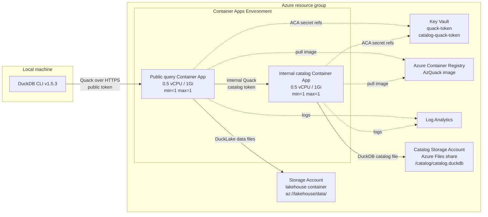
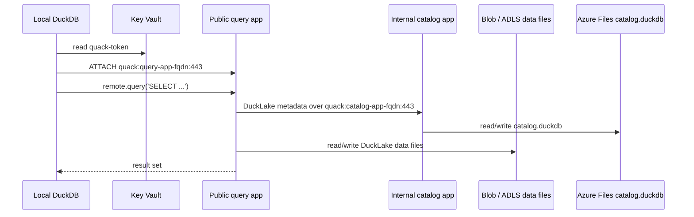
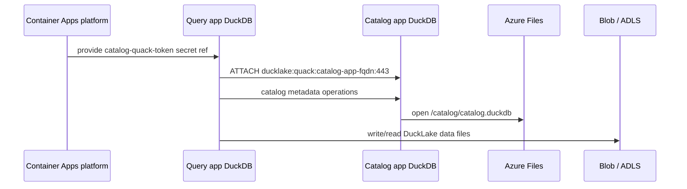
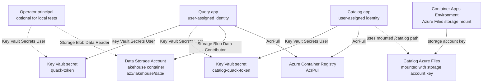
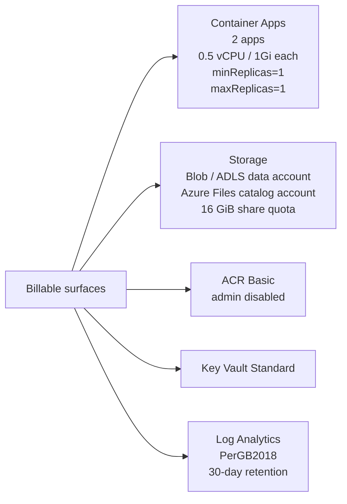

# AzQuack

You can have a full DuckLake implementation on Azure without running a PostgreSQL server for metadata.

It is not serverless in this sample: the public query app and the internal catalog app both stay warm with one replica each, because Quack serves a live DuckDB process and the catalog app owns a single DuckDB catalog file.

The capacity is intentionally small, and Azure Container Apps Consumption billing uses vCPU/GiB seconds and requests, with active/idle behavior for warm replicas. See the official [Azure Container Apps pricing page](https://azure.microsoft.com/pricing/details/container-apps/) and [billing guide](https://learn.microsoft.com/azure/container-apps/billing) to do the exact math for your region and subscription.

This repo deploys:

| App | Replicas | CPU | Memory | Role |
| --- | ---: | ---: | ---: | --- |
| `query` | 1 | `0.5` vCPU | `1Gi` | public Quack endpoint for local DuckDB clients |
| `catalog` | 1 | `0.5` vCPU | `1Gi` | internal Quack endpoint that owns DuckLake metadata |
| **Total warm ACA capacity** | **2** | **1.0** vCPU | **2Gi** | always running while the experiment is up |

That gives you the raw allocation inputs for estimating the Container Apps part of the bill:

```text
monthly vCPU-seconds = 1.0 * seconds_in_month
monthly GiB-seconds  = 2.0 * seconds_in_month
```

Add Storage, Azure Files, Key Vault, ACR, and Log Analytics for the full estimate.

> [!WARNING]
> This is a beta experiment.
> Quack is under active development, and DuckLake-with-Quack catalog support is new in DuckDB `v1.5.3`.
> Use this repo to experiment, not as a production lakehouse architecture.

## The Idea

DuckLake needs:

- a metadata catalog
- a place for data files
- a DuckDB process that can read and write both

This repo makes the metadata catalog another DuckDB process, reached through Quack.
That removes PostgreSQL from the experiment while keeping the local client experience simple:

```text
local DuckDB -> public Quack endpoint -> DuckLake -> internal Quack catalog
```

## One Deployment

After you create an AZD environment, `azd up` deploys the PostgreSQL-free stack:

- DuckLake data files in Azure Blob / ADLS-style storage
- DuckLake metadata in a DuckDB file on Azure Files
- an internal Container App that exposes the metadata DuckDB file over Quack
- a public Container App that local DuckDB clients attach to over Quack
- separate public and internal Quack tokens in Key Vault
- managed identities for image pull and Blob data access

No Azure PostgreSQL Flexible Server is created.

### Azure Deployment



## Before You Start

Install:

- Azure Developer CLI: `azd`
- Azure CLI: `az`
- DuckDB CLI `v1.5.3`
- Docker
- `curl`
- Python 3

Your Azure principal must be able to create resources and role assignments.
In practice, use `Owner`, or `Contributor` plus `User Access Administrator`, at the target subscription or resource-group scope.

Log in:

```sh
az login
az account set --subscription <subscription-id>
azd auth login
```

Check DuckDB:

```sh
duckdb -csv -c 'SELECT version();'
```

It must print:

```text
v1.5.3
```

Run the local build validation:

```sh
./scripts/check.sh
```

That runs Python compile checks, Bicep build, and Docker build.

## Deploy It

Create a fresh environment:

```sh
azd env new <unique-env-name> --location westus --subscription <subscription-id>
```

For example:

```sh
azd env new azquack-quackcat --location westus --subscription <subscription-id>
```

Then deploy:

```sh
azd up
```

The environment name becomes the resource group name:

```text
<unique-env-name> -> rg-<unique-env-name>
```

Use a new environment name for each experiment.
That keeps each deployment isolated from previous Azure resources.

## Check It

Make sure the intended environment is selected:

```sh
azd env list
azd env select <unique-env-name>
```

Run the live validation:

```sh
./scripts/validate-deployment.sh
```

Expected ending:

```text
Deployment validation passed.
```

The validator runs the main live checks:

- Azure shape: no PostgreSQL, two ACR-backed Container Apps, internal catalog ingress
- rollback shape: one active healthy revision per app, query scale `1/1`, sticky sessions disabled, public `/readyz` metadata hidden
- Quack auth: valid token works, wrong token fails
- DuckLake writes: metadata and Blob data files are created
- persistence: a query restart preserves DuckLake rows and the catalog remains healthy
- hygiene: recent logs do not contain token values available to the validator

The script reads values from the active AZD environment.

## Test Query Replicas

The default deployment keeps the public query app at one replica.
To test whether Azure Container Apps sticky sessions work with DuckDB Quack, deploy the query app with two replicas and keep the catalog app at one replica:

```sh
azd env set QUERY_MIN_REPLICAS 2
azd env set QUERY_MAX_REPLICAS 2
azd env set QUERY_STICKY_SESSIONS sticky
azd env set QUERY_EXPOSE_PLATFORM_METADATA true
azd up
./scripts/validate-sticky-sessions.py
```

The sticky-session validator checks the live Azure settings, confirms two query replicas are running, confirms the catalog is still single-replica, then runs repeated Quack calls from multiple local DuckDB clients to see whether each attached session stays on one query replica.

The current result is negative: ACA affinity works for normal cookie-aware HTTP calls, but the DuckDB Quack client does not appear to replay ACA's affinity cookie.
Repeated Quack calls after `ATTACH` can fail with `Invalid connection id` when the query app has more than one replica.
Keep the default `1/1` query replica shape unless Quack adds a cookie-aware or otherwise replica-safe client path.

## Query It From DuckDB

After validation:

```sh
./scripts/connect-local.sh
```

The script:

1. checks the local DuckDB CLI is `v1.5.3`,
2. reads `QUACK_URI` and `KEY_VAULT_NAME` from the active AZD environment,
3. reads the public Quack token from Key Vault,
4. attaches the public query app,
5. inserts one smoke-test row,
6. reads the result back through Quack.

Equivalent SQL:

```sql
INSTALL quack;
LOAD quack;

CREATE OR REPLACE SECRET azquack_remote (
    TYPE quack,
    SCOPE 'quack:<query-app-fqdn>:443',
    TOKEN '<token-from-key-vault>'
);

ATTACH 'quack:<query-app-fqdn>:443' AS remote (TYPE quack);

FROM remote.query('FROM whoami()');
FROM remote.query(
    'INSERT INTO azquack.demo.events
     SELECT 2, ''local-client-smoke'', now()
     WHERE NOT EXISTS (
       SELECT 1 FROM azquack.demo.events WHERE event_id = 2
     )'
);
FROM remote.query('SELECT * FROM azquack.demo.events ORDER BY event_id');
```

> [!WARNING]
> The public Quack token is a write credential.
> A holder can run SQL against objects visible to the query app.
> That includes transitive write access to DuckLake through the internal catalog app.
> Quack authorization callbacks are not implemented in this prototype.

You are done when:

```text
./scripts/check.sh                  passes
azd up                              completes
./scripts/validate-deployment.sh    prints "Deployment validation passed."
./scripts/connect-local.sh          attaches, writes, and reads back data
```

## How It Works

### Query Flow

Your laptop does not attach to Azure Storage or Azure Files directly.
It attaches to the public query app:



The important boundary:

- local users get `quack-token`
- the query app gets `catalog-quack-token`
- the catalog app is internal-only
- the query app is the only public ingress

### Catalog Flow

DuckLake metadata is stored through Quack, not PostgreSQL.



The query app creates an internal Quack secret:

```sql
CREATE OR REPLACE SECRET azquack_catalog_quack (
    TYPE quack,
    SCOPE 'quack:<internal-catalog-app-fqdn>:443',
    TOKEN '<internal-token-from-key-vault>'
);
```

Then it attaches DuckLake:

```sql
ATTACH 'ducklake:quack:<internal-catalog-app-fqdn>:443' AS azquack (
    DATA_PATH 'az://lakehouse/data/',
    AUTOMATIC_MIGRATION true
);

USE azquack;
```

The catalog app is the only process that opens:

```text
/catalog/catalog.duckdb
```

### Storage And Identity



The local DuckDB client does not talk to Blob Storage or Azure Files directly.

## What Gets Deployed

| Resource | Purpose |
| --- | --- |
| Storage Account | DuckLake Parquet/data files under `az://lakehouse/data/` |
| Catalog Storage Account | Azure Files share for `/catalog/catalog.duckdb` |
| Internal Container App | DuckDB catalog file exposed only inside ACA through Quack |
| Public Container App | DuckDB query endpoint exposed to local clients through Quack |
| Azure Container Registry | Stores the container image |
| Container Apps Environment | Hosts both Container Apps |
| Key Vault | Stores public and internal Quack tokens |
| Log Analytics workspace | Container App logs |
| Managed identities | Separate identities for query and catalog apps |

## Security Boundaries

This deployment is intentionally small and easy to inspect.
It is not hardened.

| Boundary | Current behavior |
| --- | --- |
| Public ingress | query app only |
| Catalog ingress | internal ACA ingress only |
| Public token | write access to the query app |
| Internal token | query app to catalog app |
| Data storage | Blob public access disabled |
| Data auth | managed identity, shared-key disabled |
| Catalog file storage | Azure Files mount with storage account key |
| ACR | admin credentials disabled |
| Key Vault | Azure RBAC, public network access enabled |

A hardened version should add private networking, stricter Quack authorization, network restrictions in front of the query app, and backup/restore automation for the catalog DuckDB file.

## Cost Model

This deployment removes the PostgreSQL Flexible Server cost.



It still creates billable resources:

- two always-on Container App replicas
- two Storage Accounts
- Azure Files
- Azure Container Registry Basic
- Key Vault
- Log Analytics

For a 730-hour month, the raw allocation inputs are:

```text
seconds in month = 730 * 60 * 60 = 2,628,000
vCPU-seconds     = 1.0 * 2,628,000 = 2,628,000
GiB-seconds      = 2.0 * 2,628,000 = 5,256,000
```

Azure documents current rates and any applicable included grants or discounts. Verify them for your subscription and region:

- [Azure Container Apps pricing](https://azure.microsoft.com/pricing/details/container-apps/)
- [Azure Container Apps billing](https://learn.microsoft.com/azure/container-apps/billing)
- [Azure pricing calculator](https://azure.microsoft.com/pricing/calculator/)

## Generated Environment Values

The AZD preprovision hook creates these values when missing:

| Value | Meaning |
| --- | --- |
| `QUACK_TOKEN` | token for local DuckDB clients |
| `CATALOG_QUACK_TOKEN` | token for query app -> internal catalog app |
| `DUCKLAKE_DATA_PATH` | default `az://lakehouse/data/` path |
| `OPERATOR_PRINCIPAL_ID` | principal allowed to read the public Quack token |
| `OPERATOR_PRINCIPAL_TYPE` | defaults to `User` |

> [!WARNING]
> `.azure/*/.env` contains generated secret values.
> The repo ignores it, but treat the active AZD environment as sensitive local state.

## Cleanup

Remove the whole experiment:

```sh
azd down --purge --force --no-prompt
```

Key Vault soft delete is enabled.
Purge protection is disabled for this prototype so cleanup can fully remove resources when your account has purge permission.

## Learn More

- [DuckDB Quack overview](https://duckdb.org/docs/current/quack/overview)
- [DuckDB Quack security](https://duckdb.org/docs/current/quack/security)
- [DuckDB 1.5.3 announcement](https://duckdb.org/2026/05/20/announcing-duckdb-153)
- [DuckLake DuckDB introduction](https://ducklake.select/docs/stable/duckdb/introduction)
- [DuckLake catalog database guidance](https://ducklake.select/docs/stable/duckdb/usage/choosing_a_catalog_database)
- [Azure Container Apps storage mounts](https://learn.microsoft.com/azure/container-apps/storage-mounts)
