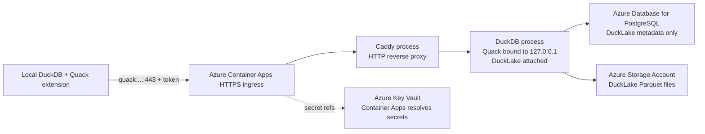

# Architecture

AzQuack deploys one remote DuckDB process and exposes it with the Quack protocol.

## Runtime Contract

- The Container App runs exactly one replica. Quack exposes a single DuckDB server session, so multiple replicas would split session state and writes.
- DuckLake metadata is stored in PostgreSQL. DuckLake data files are stored as Parquet under `az://lakehouse/data/`.
- Local clients do not connect directly to PostgreSQL or Storage. They authenticate to Quack and send SQL to the remote DuckDB server.
- Azure Container Apps terminates HTTPS and forwards HTTP to Caddy on port `8081`. The checked-in [Caddyfile](../deploy/Caddyfile) is copied into the application image and routes health checks to Python on `127.0.0.1:8080`, and routes Quack traffic to `127.0.0.1:9494` with streaming flushes and a 256 MB request body limit.

## Security Posture

- Quack requires a shared token stored in Key Vault.
- PostgreSQL is used only as a metadata catalog. Deployment creates a dedicated `ducklake_app` role for DuckLake metadata operations.
- The PostgreSQL administrator password is used only during startup role bootstrap and is removed from the process environment before Quack starts serving remote SQL.
- The Container App uses a user-assigned managed identity for Azure Blob access.
- Storage public blob access is disabled.
- ACR admin credentials are disabled; the Container App pulls with managed identity.
- A holder of the Quack token can execute SQL as the remote DuckDB server. Treat the token as write access to the DuckLake until a stricter Quack authorization callback is added.
- PostgreSQL and Key Vault still use public Azure endpoints in this prototype. A hardened variant should move those dependencies behind private networking.

## Beta Caveats

Quack is currently documented as beta in DuckDB v1.5.2 and distributed from `core_nightly`. Function names, settings, and defaults may change. The Docker image installs extensions at startup so it picks up the current extension repository behavior during deployment.
