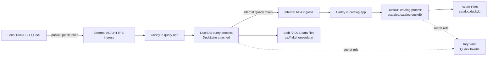

# Architecture

AzQuack now uses a PostgreSQL-free DuckLake catalog experiment.

## Runtime Contract

- The query Container App exposes the only public Quack endpoint.
- The catalog Container App uses internal Container Apps ingress only.
- The catalog app is the only process that opens `/catalog/catalog.duckdb`.
- The query app attaches DuckLake with `ducklake:quack:<internal-catalog-fqdn>:443`.
- DuckLake data files are written by the query app to `az://lakehouse/data/`.
- Both Container Apps run with `minReplicas: 1` and `maxReplicas: 1`.

## Storage Contract

DuckLake uses two Azure storage surfaces:

| Storage | Used for | Access |
| --- | --- | --- |
| Blob / ADLS container | Parquet/data files | query app managed identity |
| Azure Files share | DuckDB metadata catalog file | Container Apps Azure Files mount |

The data Storage Account disables shared-key access.
The catalog Storage Account keeps shared-key access enabled because Azure Container Apps Azure Files mounts require an account key.

## Security Posture

- `quack-token` is for local DuckDB clients and the public query app.
- `catalog-quack-token` is for query app to internal catalog app only.
- Normal local client scripts do not read `catalog-quack-token`; the validator reads the local AZD value when available only to scan logs for leaks.
- Key Vault grants each Container App identity only the secret refs it needs.
- ACR admin credentials are disabled; both apps pull with managed identity.
- The public query app remains internet-reachable and token-protected.
- A public-token holder has transitive write access to DuckLake through the query app, even though the internal catalog token is not exposed locally.

> [!WARNING]
> Quack token authentication does not restrict SQL by itself.
> A token holder can run SQL against objects visible to the server session.

## Beta Caveats

This design relies on DuckDB `v1.5.3`, where Quack is a core extension and DuckLake can use a Quack endpoint as the metadata catalog.
The behavior is new and should be treated as experimental until restart, rollback, concurrency, and backup behavior are proven for your workload.
